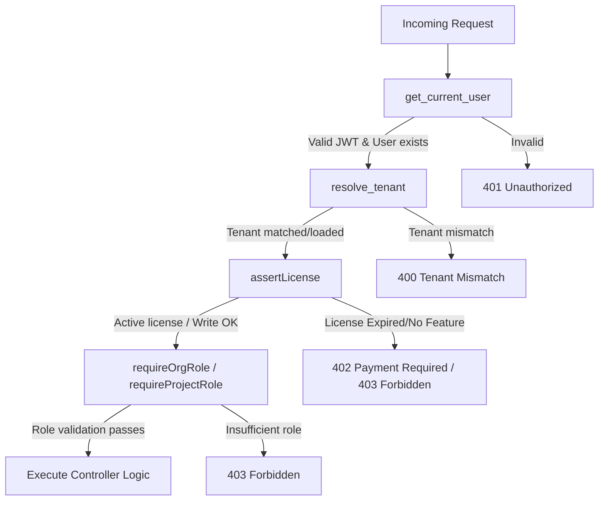

# DecisionVault Codebase Architecture & Technical Report

This document provides a complete technical analysis and structural mapping of the **DecisionVault** codebase. It covers package layouts, system architecture, routing models, security mechanisms, database schemas, frontend/client structure, integration points, and key development patterns discovered during the codebase walkthrough.

---

## 1. High-Level Workspace Structure

The workspace is organized into three distinct sub-projects:

1. **`decision_vault_api`**: A multi-tenant FastAPI backend that orchestrates data storage (MongoDB, Postgres, Redis), authorization, and connector ingestion.
2. **`decision_vault_ui`**: A modern dark-aesthetic React single-page application built on Vite and TailwindCSS, utilizing Radix UI for interactive components, XYFlow (`@xyflow/react`) for relational schema/sequence charts, and Framer Motion.
3. **`decision_vault_mobile-Desktop`**: A cross-platform shell enclosing a React Native (Expo) app and an Electron wrapper for desktop runtime.

```
decision-vault/
├── decision_vault_api/          # FastAPI Backend (Python)
├── decision_vault_ui/           # React + Vite Frontend (JavaScript/JSX)
└── decision_vault_mobile-Desktop/ # React Native + Electron Client (TypeScript/TSX)
```

---

## 2. Backend Architecture (`decision_vault_api`)

The backend is built around FastAPI and operates on an asynchronous request pipeline. 

### 2.1 Package Mapping
The package directory structure in `app/` is mapped as follows:
* **`app/main.py`**: The application entry point. Handles startup/shutdown lifecycles, database index initialization, global middleware registration, routing inclusion, and general diagnostics.
* **`app/core/`**: Central application configurations (`config.py`), RBAC permission matrices (`rbac.py`), license feature maps (`license.py`), and error classes (`errors.py`).
* **`app/db/`**: Asynchronous database connectors. `mongo.py` maps the Motor client for MongoDB, and `postgres.py` manages an optional Postgres connection pool.
* **`app/middleware/`**: Contains the request validation chain (authentication, tenant mapping, license gating, and RBAC authorization).
* **`app/api/`**: FastAPI router modules representing the REST API controllers.
* **`app/services/`**: The core business logic layer. Implements services for authentication, project tracking, connectors (Slack, Microsoft Teams, Google Chat, Zoom, Custom), messaging, billing, and LLM generation graphs.
* **`app/schemas/`**: Pydantic input validation and response contracts.
* **`app/utils/`**: Helper utilities for security, token encoding, custom markdown rendering, and string-to-JSON repairs.

---

### 2.2 The Request & Middleware Pipeline
Route security and scoping are handled via custom FastAPI dependency injection using the `withGuard` dependency from [guard.py](file:///Users/kaviii/decision-vault/decision_vault_api/app/middleware/guard.py). 

When a route is decorated with `Depends(withGuard(...))`, it executes four checks sequentially:



1. **`get_current_user`** ([auth.py](file:///Users/kaviii/decision-vault/decision_vault_api/app/middleware/auth.py)): Verifies the Bearer JWT token, parses claims, loads the user document from MongoDB, and sets `request.state.user`.
2. **`resolve_tenant`** ([tenant.py](file:///Users/kaviii/decision-vault/decision_vault_api/app/middleware/tenant.py)): Resolves the tenant context using path variables, headers, or query parameters, and guarantees it matches the authenticated user's `tenant_id`. Stores the resolved tenant ID in `request.state.tenant_id`.
3. **`assertLicense(feature)`** ([license.py](file:///Users/kaviii/decision-vault/decision_vault_api/app/middleware/license.py)): Checks if the current tenant license supports the given feature, gates access if expired, and enforces a read-only write-block if the subscription is in a grace/expired status.
4. **Role Gating** ([rbac.py](file:///Users/kaviii/decision-vault/decision_vault_api/app/middleware/rbac.py)): Evaluates minimum org role claims (Viewer, Member, Admin, Owner) and checks project-specific memberships in the `project_members` collection (Viewer, Contributor, Project Admin).

---

### 2.3 Identity, Sessions, and Security Strategies
* **Access vs. Refresh Tokens**: Authentication returns short-lived JSON Web Tokens (15-minute TTL) inside JSON payloads. In contrast, the rotation refresh token is set inside a secure, HttpOnly, SameSite cookie named `dv_refresh`.
* **Refresh Token Rotation & Theft Detection**: Inside the database, refresh tokens track revocation chains (`revoked` status, `replaced_by` tracker, and `token_hash` based on HMAC-SHA256). If a refresh token request fails the cryptographic HMAC check or attempts to reuse a previously rotated/revoked token, the server immediately revokes all refresh tokens associated with that user account to stop active hijacking.
* **Encryption at Rest**: High-value credentials (e.g., Slack OAuth bot access tokens, Teams tokens) are encrypted in MongoDB using cryptographic primitives from `app/services/crypto_service.py`.

---

### 2.4 Data Store Architecture & Multi-Tenancy
* **MongoDB (Primary Document Store)**: Manages unstructured document-like resources including user profiles, tenant configurations, project boards, messaging streams, connector registrations, and generated system diagrams.
  > [!TIP]
  > During startup, `app/main.py` enforces index-first creations. If duplicate documents prevent applying unique indexes (such as tenant slug or project memberships), the application logs migration commands (`migrate_licenses.py`) and continues running to avoid initialization crashes in legacy environments.
* **Redis (Optional Cache & Limiter)**: Used for request rate-limiting (via `fastapi-limiter` on intake and custom connectors) and caching generation payloads (using `app/services/cache_service.py`). If Redis is offline, rate-limiting is bypassed and caching gracefully falls back to in-memory dictionary storage.
* **Postgres (Optional Analytics)**: Stores structured PRD data and usage tables (via `asyncpg`). Startup scripts invoke database preparation helpers but catch exceptions to degrade gracefully if Postgres is not configured.

---

### 2.5 Ingestion & Connectors
The API supports ingestion from multiple communication platforms, mapping external conversation threads to project spaces:
1. **Slack**: Authenticates using OAuth, signs incoming webhooks using Slack secrets, maps spaces via `slack_channel_mappings`, and analyzes threaded messages for decision signaling before storing them.
2. **Microsoft Teams**: Subscribes to Microsoft Graph webhooks and utilizes a delta synchronization service to fetch historical channel activities.
3. **Zoom & Google Chat**: Zoom verifies webhooks via custom credentials, while Google Chat verifies domains and tracks spaces as scoped streams.
4. **Custom Connector**: A generic ingestion API supporting rotatable `x-api-key` headers, HMAC `x-signature` matching, or OAuth bearer tokens. Features payload size checking (`Content-Length` enforcement) and delivery queues with retry-backoff configurations.

---

### 2.6 AI Generation Pipelines & LangGraph Logic
All LangGraph-based AI generation pipelines, services, and associated endpoints/files have been removed from the backend codebase.

---

## 3. Frontend Architecture (`decision_vault_ui`)

The UI is a React application built with Vite and TailwindCSS, styled with a modern dark aesthetic.

### 3.1 Routing & Layout Mapping
The frontend routing is configured in [routes.jsx](file:///Users/kaviii/decision-vault/decision_vault_ui/src/router/routes.jsx):
* **Guest Routes (`/`)**: Hosts the Auth layout, landing page, and authentication forms (Login, Signup, Forgot Password).
* **Protected Org Routes (`/organizations`)**: Scoped to authenticated users; presents organization listings, organization setup, and subscription plans.
* **Protected Project Routes (`/organizations/:orgId/projects`)**: Scoped to project setup, settings, integration connections, and model settings.
* **Project Dashboard Layout (`/organizations/:orgId/projects/:projectId/dashboard`)**: The core interactive workspace containing the requirements intake view (`InputMainPage`), the document viewer (`GeneratedPrdViewPage`), team profiles, log views, settings, and the messaging layout.

---

### 3.2 Key Components & Services
* **`apiClient.js`** ([apiClient.js](file:///Users/kaviii/decision-vault/decision_vault_ui/src/services/apiClient.js)): 
  Translates and fires standard fetch operations. Features an automatic `401 Unauthorized` interceptor that attempts to retrieve new access tokens via `/api/auth/refresh`. If the refresh fails, it dispatchs a `dv:auth-logout` event to clear client state.
* **XYFlow Integration**: 
  Renders interactive flow charts (schema entities and sequence blocks) inside the workspace using `@xyflow/react`.
* **Mermaid Rendering**: 
  Utilizes the `mermaid` package to render architectural blocks and sequence loops on client devices.

---

## 4. Mobile & Desktop Client (`decision_vault_mobile-Desktop`)

The client directory is an Expo React Native workspace capable of compiling for iOS/Android and launching as an Electron window wrapper.

* **Entry Point (`App.tsx`)**: 
  A simple React Native navigation controller directing the user flow between `OnboardingScreen` and `AuthScreen`.
* **Screens (`src/screens/`)**:
  - `OnboardingScreen.tsx`: Introduction workflow.
  - `AuthScreen.tsx`: Secure form handler supporting tenant creation (signup) or domain slug check-in (login). Integrates token storage via a local helper.
  - `DecisionDetailScreen.tsx`: A rendering card displaying loaded decision details.
* **Storage and API (`src/services/`)**:
  - `authStore.ts`: Manages secure application storage key writes.
  - `authApi.ts`: Communicates with backend endpoints (`/api/auth/login`, `/api/auth/signup`, `/api/auth/refresh`).

---

## 5. Architectural Findings & Key Discoveries

| Feature Area | File / Service | Findings / Custom Decisions |
| :--- | :--- | :--- |
| **Refreshes** | [auth_service.py](file:///Users/kaviii/decision-vault/decision_vault_api/app/services/auth_service.py) | Rotation checks use SHA256 HMAC values. Attempting to reuse an old refresh token instantly invalidates the user's entire session chain. |
| **Infra Depend** | [main.py](file:///Users/kaviii/decision-vault/decision_vault_api/app/main.py) | Both Redis and Postgres integrations fail gracefully during startup. If missing, caching drops back to memory, rate-limiting is disabled, and table inserts are caught. |
| **API Path Collision** | [projects.py](file:///Users/kaviii/decision-vault/decision_vault_api/app/api/projects.py) | Routes like `/catalog` have special `/meta/` configurations to prevent path matching conflicts. |
| **Ingestion Security** | [custom_connector.py](file:///Users/kaviii/decision-vault/decision_vault_api/app/api/custom_connector.py) | Flexible auth supports HMAC signature matches, SHA256 hashed API keys, or OAuth Client Credentials standard. |
