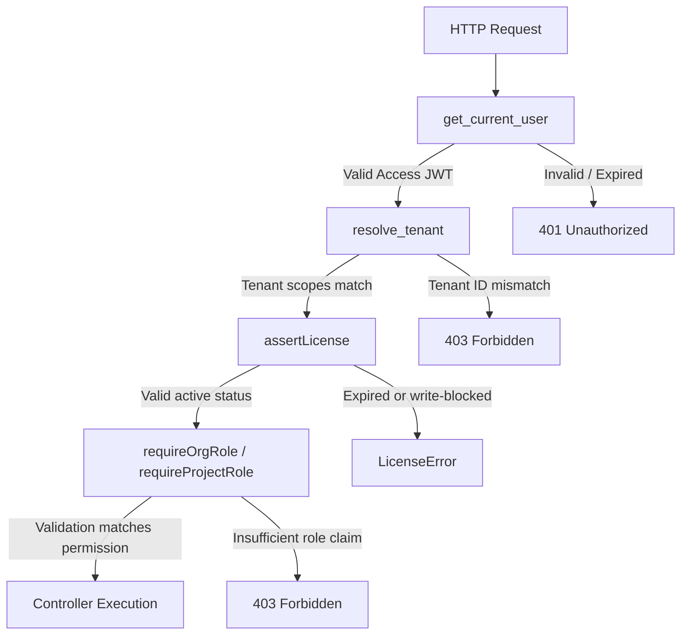

# DecisionVault Backend — Codebase Summary & Architectural Guide

This document provides a comprehensive technical overview of the current **DecisionVault Backend** codebase structure, routing pipelines, middleware guard system, database operations, and deployment configuration.

---

## 1. Core Tech Stack
* **Language/Runtime**: Python 3.11 / 3.12
* **Web Framework**: FastAPI (ASGI) & Uvicorn (dev runner)
* **Primary Database**: MongoDB (asynchronous operations via the `Motor` driver)
* **Cache / Rate Limiter**: Redis (utilizes `fastapi-limiter` for request protection, degrades gracefully to in-memory fallback if Redis is offline)
* **Hosting / Runtime Environment**: Vercel Serverless Functions (configured via a root-level `index.py` wrapper and `vercel.json` builder)

---

## 2. Codebase Directory Map

The Python backend is packaged under the `app/` folder, structured as follows:

```
decision_vault_api/
├── .python-version      # Specifies Python version (3.12)
├── requirements.txt     # Local development and test dependencies
├── requirements.cloud.txt # Cloud deployment production dependencies
├── vercel.json          # Vercel deployment and routing config
├── index.py             # Root entry point wrapper for Vercel hosting
├── app/
│   ├── main.py          # FastAPI app setup, middleware, and router registration
│   ├── api/             # HTTP Route Controllers (FastAPI Routers)
│   ├── core/            # Configs, RBAC rules, license feature configurations
│   ├── db/              # Database pool connectors (Mongo & Postgres)
│   ├── middleware/      # Authentication, tenant validation, RBAC, and license checks
│   ├── schemas/         # Pydantic validation request/response models
│   ├── services/        # Central business logic (Auth, License, Audit, Billing, SMTP)
│   └── utils/           # Encryption, serialization, and token JWT utilities
```

---

## 3. Router Map (`app/api/`)

The API endpoints are modularized across thin controllers, delegating complex operations to the service layer:

### 🔑 `auth.py`
Manages identity and session lifetimes:
* **Signup / Login**: `/api/auth/signup` & `/api/auth/login` (Standard email/password login).
* **Refresh Token Rotation**: `/api/auth/refresh` (Uses HTTP-only secure cookie `dv_refresh` to rotate JWT tokens and detect reuse/theft).
* **Logout**: `/api/auth/logout`.
* **Google OAuth**: `/api/auth/google` (Triggers social login callback chains).
* **Session Details**: `/api/auth/session` (Retrieves active user and tenant payload metadata).

### 💳 `billing.py`
Integrates payment checkout routing:
* **Checkout Checkout**: `/api/orgs/{org_id}/billing/checkout` (Generates Checkout sessions/URLs for Starter and Team plan tiers).

### 📋 `onboarding.py`
Captures initial workspace metadata:
* **Onboarding progress**: `/api/onboarding` (GET / POST for storing workspace configurations, tools selected, and usage source).

### 🏢 `orgs.py`
Tenant organization controls:
* **Org CRUD**: `/api/orgs/me` (Maintains active organization configurations).
* **Invitation pipelines**: `/api/orgs/me/invites` (Sends email invitations, lists active invitations, accepts invite tokens).

### 📁 `projects.py`
Scoped project-level entities:
* **CRUD Operations**: Scopes standard GET, POST, PUT, DELETE, and `/restore` actions for projects.
* **Owner Summary KPI Dashboard**: `/api/projects/{project_id}/dashboard/owner-summary` (Aggregates workspace statistics, team size, recent activities, and audit logs).

### 🛠️ `resources.py`
Aggregates licensing utility controls and system health logs:
* **Licenses**: `/api/licenses/current` and `/api/licenses/banner` (Displays active license warnings and current plans).
* **Admin Utilities**: Global audit logs and license duplicate checks.
* **LLM Health Probe**: `/api/admin/llm/health` (Probes diagnostic endpoint status).

---

## 4. The Composable Middleware Pipeline (`withGuard`)

Access control, license validation, and RBAC checking are executed sequentially via FastAPI's dependency injection using **`Depends(withGuard(...))`** defined in `app/middleware/guard.py`:



### 1. `get_current_user` ([auth.py](file:///Users/kaviii/decision-vault/decision_vault_api/app/middleware/auth.py))
Extracts and validates the Bearer JWT token from the `Authorization` header, verifying the signature, audience, and active state of the user. Sets `request.state.user`.

### 2. `resolve_tenant` ([tenant.py](file:///Users/kaviii/decision-vault/decision_vault_api/app/middleware/tenant.py))
Resolves the tenant context (Org ID) from request parameters (path, query, or headers) and guarantees it matches the authenticated user's `tenant_id` claim to prevent cross-tenant privilege escalation. Sets `request.state.tenant_id`.

### 3. `assertLicense(feature)` ([license.py](file:///Users/kaviii/decision-vault/decision_vault_api/app/middleware/license.py))
Evaluates the tenant's current license.
* **Suspended Plan**: Denies all API traffic.
* **Expired/Grace Period**: Triggers **write-blocking** protection for structural actions (like `upload_document` or `manage_integrations`), putting the workspace into read-only mode.
* **Feature Gating**: Restricts higher-tier operations to licensed plans (`trial`, `starter`, `team`, or `enterprise`).

### 4. Role Authorization Gating ([rbac.py](file:///Users/kaviii/decision-vault/decision_vault_api/app/middleware/rbac.py))
* **`requireOrgRole`**: Checks the user's role claim (`viewer`, `member`, `admin`, `owner`) against the requested minimum permission rules.
* **`requireProjectRole`**: Verifies memberships in the `project_members` collection (`viewer`, `contributor`, `project_admin`) for project-scoped routes.

---

## 5. Light LLM Diagnostics Endpoint

To avoid dependency on heavy frameworks like **LangChain** and **LangGraph**, the LLM health test logic has been refactored inside **[llm_health_service.py](file:///Users/kaviii/decision-vault/decision_vault_api/app/services/llm_health_service.py)**. 

It queries chat endpoints directly using a lightweight, asynchronous `httpx.AsyncClient`:
* **OpenAI provider**: Executes standard payload POST to `https://api.openai.com/v1/chat/completions`.
* **Gemini provider**: Executes payload POST to the standard Google Generative AI beta endpoint.

---

## 6. Hosting Configuration (Vercel)

The backend is configured for Vercel Serverless Function environments using two configuration files:

* **[index.py](file:///Users/kaviii/decision-vault/decision_vault_api/index.py)**: Exposes the FastAPI `app` variable at the root level so that Vercel can locate the ASGI application while maintaining absolute import paths starting with `app/...`.
* **[vercel.json](file:///Users/kaviii/decision-vault/decision_vault_api/vercel.json)**: Instructs Vercel to route all incoming HTTP requests to the `index.py` serverless runtime with a maximum invocation duration of 60 seconds.
